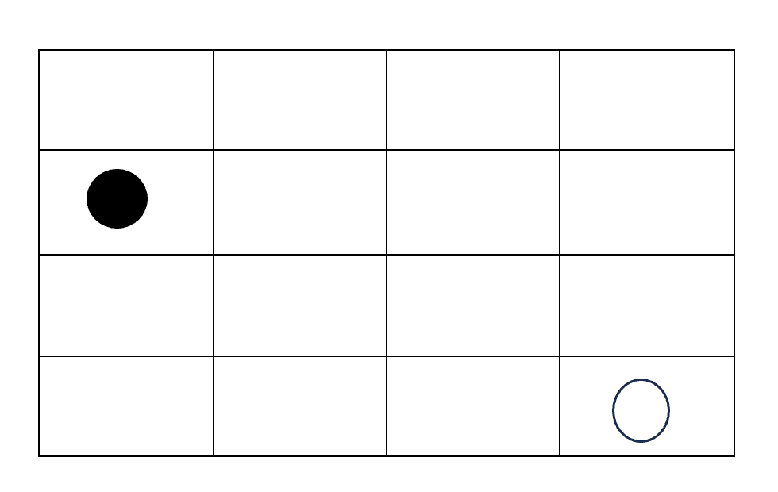

# ASP Microproject



Given a 4 by 4 grid as above, write an ASP program to generate a directed path from the white circle to the black circle by linking horizontally or vertically adjacent cells.The path traverses cells of the square grid without ever crossing or intersecting itself.


The square grid is represented by facts of the following predicates:
```
cell(X,Y).   % the cell (X,Y) belongs to the grid
first(X,Y).  % the first cell of the path (marked with a white circle) is (X,Y)
final(X,Y).  % the final cell of the path (marked with a black circle) is (X,Y)
```
The example shown before is represented by the following facts:
```
cell(1..5,1..5).
first(4,1).
final(1,3).
```
The solution is represented by atoms of predicate path/4:

```
path(X1,Y1,X2,Y2). % the path has an edge between the cells (X1,Y1) and (X2,Y2)
```
For instance, the solution of the example consists of the following atoms:
```
path(4,1,3,1)  path(3,1,2,1)  path(2,1,1,1) 
path(1,1,1,2)  path(1,2,1,3) 
```
To submit your solution, please modify the file [findpath.lp](findpath.lp).

Please commit your code to GitHub.
Because there are too many possible paths, we don't have auto test available. Please submit a screen shot of your output on GitHub too.
